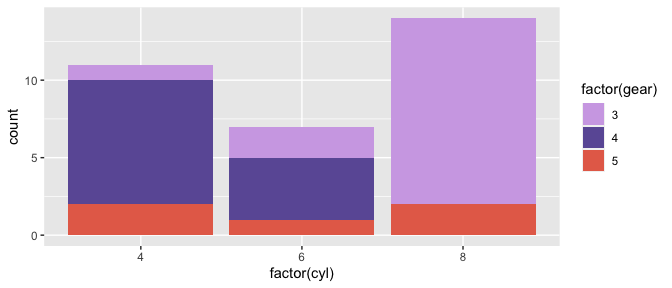
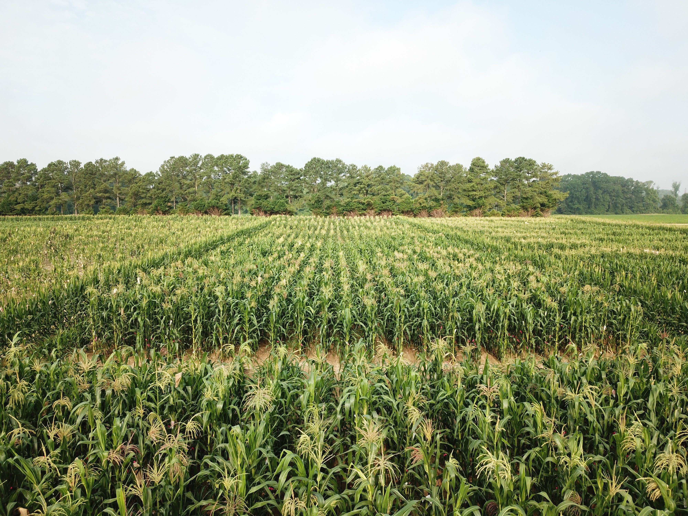

<!-- README.md is generated from README.Rmd. Please edit that file -->


### Why MaizePal?

About one year ago, my research took an unexpected turn & I found myself
studying maize. For better or worse, I was here, surrounded by corn & by
people who seemed to be obsessed with it. At first, I didn’t “get it”
because to me, corn was corn was corn. It was yellow and green and
covered vast swaths of the Midwest. Anyone who studies maize landraces,
however, knows that this is not a very generous archetype.

> Landraces are varieties of crops that have been bred by farmers
> through artificial selection outside of the formal breeding sector and
> are often associated with a particular agroecosystem and cultural
> heritage.

The lab I recently joined ([GEMMAlab](https://www.gemmalab.org/))
studies maize landraces to ask fundamental questions about evolution and
adaptation, knowledge that we can then apply to practical applications
in breeding and conservation. In many ways, our lab’s research exists in
sharp contrast to my initial assessment of the crop, and after a season
working in the nursery, I am now convinced that maize is far more
beautiful than my mental archetype gave it credit for. Of the many
varieties growing in our nursery, we harvested cobs with kernels that
were shiny and red as rubies, and others that were pink and purple and
looked like they belonged in a candy shop. Further searching into
international collections online revealed cobs from Oaxaca that were
jade green and blue, cobs from Peru that looked like cream-colored pine
cones with purple speckles, and still others that are pitch black when
harvested and magenta when milled.

The variety of colors and shapes seems endless, and I could wax poetic
about how wrong I was that corn is just yellow and green. Instead, I
wrote an R package inspired by the colors and cobs I’ve seen. This
collection of color palettes is not perfect nor complete, and I will
continue to add to it as I come across more cobs I would like to
document and share. In the meantime, I hope you find this package to be
useful, colorful, and fun.


> The above picture is of a mapping population that our lab is currently
> working with, as a part of the [Genetics of Highland Adaptation in
> Maize](http://highlandadaptation.org/) project. The parent landraces
> of this population are from highlands fields in Central and South
> America (Sabanero, Bolita, Connor, Pising, Azul, Mishca, Cpunti, and
> Palomero).

Installation
------------

``` r
install.packages("MaizePal")
```

Usage
-----

``` r
library("MaizePal")

# See all palettes
names(maize_palettes)
#>  [1] "Anthocyanins1" "Anthocyanins2" "RubyGold"      "Sweetest"     
#>  [5] "GlassGem"      "PodCorn"       "HighlandMAGIC" "MaizAzul"     
#>  [9] "JimmyRed"      "FloweringTime" "HopiBlue"      "Painted"      
#> [13] "MaizMorado"    "OaxacaGreen"
```

Palettes
========

### Sweetest

``` r
maize_pal("Sweetest")
```


### Anthocyanins1

``` r
maize_pal("Anthocyanins1")
```


### Anthocyanins2

``` r
maize_pal("Anthocyanins2")
```


### RubyGold

``` r
maize_pal("RubyGold")
```


### JimmyRed

``` r
maize_pal("JimmyRed")
```


### MaizAzul

``` r
maize_pal("MaizAzul")
```


### HopiBlue

``` r
maize_pal("HopiBlue")
```


### GlassGem

``` r
maize_pal("GlassGem")
```


``` r
library("ggplot2")
ggplot(mtcars, aes(factor(cyl), fill=factor(gear))) +  geom_bar() +
  scale_fill_manual(values = maize_pal("GlassGem"))
```



### Painted

``` r
maize_pal("Painted")
```


### MaizMorado

``` r
maize_pal("MaizMorado")
```


### OaxacaGreen

``` r
maize_pal("OaxacaGreen")
```


### FloweringTime

``` r
maize_pal("FloweringTime")
```


### PodCorn

``` r
maize_pal("PodCorn")
```


### HighlandMAGIC

``` r
maize_pal("HighlandMAGIC")
```




> Our summer nursery at the Central Crops Research Station in NC
